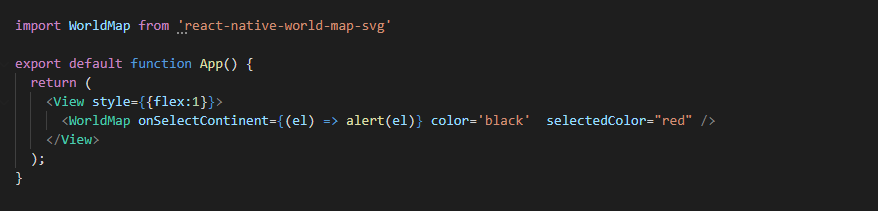

# world-map-svg

 you can find the source code under the source file feel free to check it out and leave your feedback

Clickable World Map SVG.

<h2><a id="user-content-example" class="anchor" aria-hidden="true" href="#example"><svg class="octicon octicon-link" viewBox="0 0 16 16" version="1.1" width="16" height="16" aria-hidden="true"></svg></a>Example</h2>

    
    
<table>
<thead>
<tr>
<th align="left">Property</th>
<th align="left">Type</th>
<th align="left">Required</th>
<th align="left">Default value</th>
<th align="left">Description</th>
</tr>
</thead>
<tbody>
<tr>
<td align="left">color</td>
<td align="left">string</td>
<td align="left">yes</td>
<td align="left"></td>
<td align="left">the color of the map</td>
</tr>
<tr>
<td align="left">selectedColor</td>
<td align="left">string</td>
<td align="left">yes</td>
<td align="left"></td>
<td align="left">when you select a Continent it get's this color</td>
</tr>
<tr>
<td align="left">Continentcolors</td>
<td align="left">object</td>
<td align="left">no</td>
<td align="left"></td>
<td align="left">if you want each continent to have it's own color example 
    const colors ={
    Africa:'#5B8437',
    SouthAmerica: '#DE7480',
    Europe: '#CE3B29',
    Asia: '#E7C73E',
    NorthAmerica: '#E6813E',
    Australia: '#815C28'
}
</td>
</tr>
<tr>
<td align="left">onSelectContinent</td>
<td align="left">funciton</td>
<td align="left">yes</td>
<td align="left"></td>
<td align="left">callback when the the continent is selected</td>
</tr>
</tbody>
</table>

</article>
